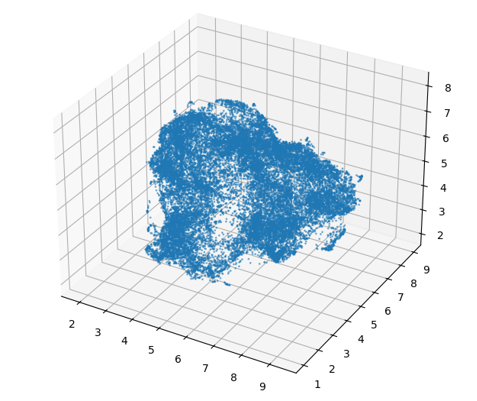
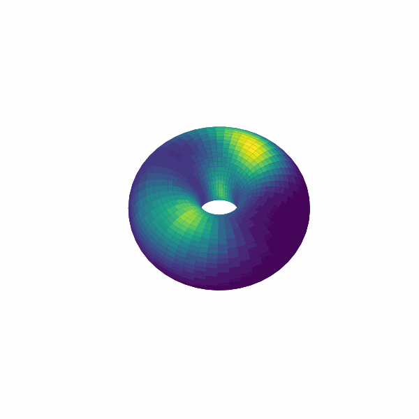

# CANN Data Analysis

## 📌 Overview
Data analysis and visualization tools for real biological neural data encoding head direction or spatial position.  
This repo provides pipelines to analyze **1D/2D Continuous Attractor Neural Network (CANN)** dynamics from real neural data and to visualize activity “bumps” on neural manifolds.

---

## 📖 Documentation
**Read the full documentation online → https://airs702.github.io/CANN-data-analysis/**  
(or jump to the intro page: https://airs702.github.io/CANN-data-analysis/intro.html)

---

## 🚀 Quick Start
```bash
git clone https://github.com/Airs702/CANN-data-analysis.git
cd CANN-data-analysis
# open and run notebooks inside the example/ folder
```

---

## 📂 Repository Structure
- `example/` – Example notebooks for 1D & 2D CANN analysis  
- `data/` – Sample datasets  
- `docs/` – Jupyter Book source (markdown, config); site is deployed from the gh-pages branch  
- `utils.py` / `utils1d.py` – Utility functions

---

## 🖼️ Example Visualizations
| 1D bump                  | UMAP projection       | Torus bump                      |
|--------------------------|-----------------------|---------------------------------|
|  |  |  |


---

